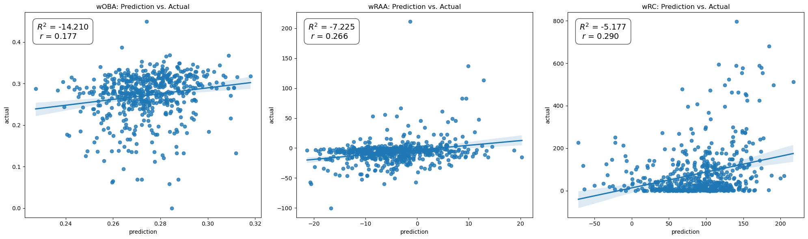
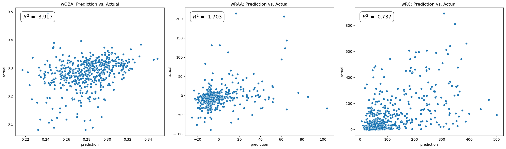

# MiLB-Prospects-Batting-Projections

## Overview
Trying to predict how a player will perform once they get to the big leagues has always been a question since the inception of the minor leagues in baseball. For a long time, player evaluations for the minor leagues have been more of an eye test and outdated statistics as Sabermetrics and Advanced Analytics have taught us through recent decades. I want to find out just how much of a difference traditional batting statistics (BA, OBP, SLG, OPS, etc.) differ from current advanced analytics (HardHit%, LA%, Bat Speed, etc.) when it comes to using them in creating machine learning models. In this project, I will attempt to showcase the value of having advanced analytics in StatCast data when it comes to predicting major league success for minor league players in terms of their batting performance.

## Data
* MiLB batted data (2015-2025) from [FanGraphs](https://www.fangraphs.com/leaders/minor-league?pos=all&level=1&lg=2,4,5,6,7,8,9,10,11,14,12,13,15,16,17,18,30,32&stats=bat&qual=y&type=1&team=&season=2015&seasonEnd=2025&org=&ind=0&splitTeam=true&players=&sort=20,1).
* MiLB data (2023-2025) from [StatCast](https://baseballsavant.mlb.com/statcast-search-minors).
* MLB data (2015-2025) from [StatCast](https://baseballsavant.mlb.com/leaderboard/custom?year=2025&type=batter&filter=&min=q&selections=pa%2Ck_percent%2Cbb_percent%2Cwoba%2Cxwoba%2Csweet_spot_percent%2Cbarrel_batted_rate%2Chard_hit_percent%2Cavg_best_speed%2Cavg_hyper_speed%2Cwhiff_percent%2Cswing_percent&chart=false&x=pa&y=pa&r=no&chartType=beeswarm&sort=xwoba&sortDir=desc).
* PlayerIDs from [Chadwick Bureau](https://github.com/chadwickbureau).

## File Structure
```
📂 MiLB-Prospects-Batting-Projections
├── README.md
├── correlation_plots.ipynb
├── data
│   ├── chadwick-bureau
│   │   ├── chadwick-bureau-mapping.csv  # Full data of Chadwick Bureau files
│   │   ├── ...
│   ├── fangraphs-minor-leagues
│   │   ├── fangraphs-minor-league-leaders-A+.csv
│   │   ├── fangraphs-minor-league-leaders-A-.csv
│   │   ├── fangraphs-minor-league-leaders-A.csv
│   │   ├── fangraphs-minor-league-leaders-AA.csv
│   │   └── fangraphs-minor-league-leaders-AAA.csv
│   ├── final_id_mapping.csv             # Mapping of Players to their StatCastID and FanGraphsID
│   ├── fixed-values
│   │   ├── al-league-data.csv           # AL Batting Data
│   │   ├── annual-woba-values.csv       # wOBA values and scale
│   │   ├── nl-league-data.csv           # NL Batting Data
│   │   └── park-factors.csv             # Park factors
│   ├── full-mlb-stats.csv               # MLB stats by Player Name and Year
│   ├── milb-players.csv                 # MiLB stats by Player Name and Year
│   ├── minors_to_majors.csv             # Combination of milb-players.csv and mlb-career-stats.csv
│   ├── mlb-career-stats.csv             # Career stats of players at the MLB level
│   ├── player_mapping.csv               # Redundant
│   ├── statcast-major-leagues
│   │   ├── mlb-stats-2015.csv
│   │   ├── mlb-stats-2016.csv
│   │   ├── ...
│   │   ├── mlb-stats-2024.csv
│   │   └── mlb-stats-2025.csv
│   └── statcast-minor-leagues
│       ├── savant_data_2023.csv
│       ├── savant_data_2024.csv
│       └── savant_data_2025.csv
├── eda-milb.ipynb                       # EDA of MiLB FanGraphs data
├── fixed-values-initialization.ipynb    # Initialization of fixed values
├── img
│   ├── model_results.png                # Model results image
│   └── statcast_model_results.png       # Model results using StatCast data image
├── mlb-stats-calculation.ipynb          # Calculation of MLB stats (wOBA, wRAA, wRC, etc.)
├── models.ipynb                         # Model using FanGraph data
├── player_mapping.ipynb                 # Player ID mappings file
└── statcast_model.ipynb                 # Model using StatCast data
```

## Methodology

### 1) Define Goals

- **Target**: Create models to predict the career weighted on-base avearge (wOBA), weighted runs above average (wRAA), and weighed Runs Created (wRC) of MLB players using their minor league batting data as predictive variables. Group by Player Name and Year as we want to know how a player's performance for that singular season can determined their major league production.
    - Model 1: Model using traditional batting statistics obtained from FanGraphs.
    - Model 2: Model using advanced analytics obtained from StatCast.

### 2) Get Data

- **MiLB FanGraphs Data**: Data of MiLB players from Low A to Triple A from 2015 to 2025 obtained from FanGraphs with these columns: `Season, Name, Team, Level, Age, PA, BB%, K%, BB/K, AVG, OBP, SLG, OPS, ISO, Spd, BABIP, wSB, wRC, wRAA, wOBA, wRC+, PlayerId`
- **MiLB StatCast Data**: Data of MiLB players from Triple A only from 2023 to 2025 obtained from StatCast with advanced analytics statistics as columns such as but not limited to: `woba, xwoba, xba, xobp, xslg, hardhit_percent, launch_speed, launch_angle`.
- **MLB StatCast Data**: Data of MLB players from 2015 to 2025 obtained from StatCast with only neccesary statistics to calculate the players' wOBA, wRAA, and wRC.
- **Chadwick Bureau**: Database of the IDs of players (and others) across different sites including StatCast/MLBAM and FanGraphs, allowing for cross references to join MiLB FanGraphs Data with MLB StatCast Data.
- **Fixed Values**: `fixed-values-initialization.ipynb` contains the annual league wide wOBA values and scale alongside the annual Park Factors as well. These values are to be used in calculating wOBA, wRAA, and wRC for MLB players later on.

### 3) EDA

- Visualize distrbutions of minor league data in `eda_milb.ipynb`.

### 4) Calculate Stats for MLB

- Since StatCast does not provide player wRAA and wRC statistics, I calculated them using available data instead. I also calculated wOBA using its components to get a more precise calculation for wRAA and wRC since StatCast provided wOBA only goes up to 3 decimal points, limiting precision.
- Formulas:
  - `wOBA` = $$\frac{(wBB \times uBB)+(wHBP \times HBP)+(w1B \times 1B)+(w2B \times 2B)+(w3B*3B)+(wHR \times HR)}{AB+BB-IBB+SF+HBP}$$
  - `wRAA` = $$(\frac{wOBA - lgwOBA}{wOBAScale})* PA$$
  - `wRC` =  $$(\frac{wOBA - lgwOBA}{wOBAScale} + \frac{lgRun}{PA}) * PA$$
  - <u>Note</u>: All weights can be found in `fixed-values-initialization.ipynb`.

### 5) Calculate Career Stats

- While a player's minor league data is sorted by their names and individual years, our target variables will be based on their career stats i.e. their career wOBA, and aggregate wRAA and wRC across their time in the  MLB. The reason for this is because organizations do not want to predict how a minor league player would want to do in a singular MLB season but rather how much the player can contribute to the team as a whole across multiple years and their career.
- Formulas:
  - `Career wOBA` = $$\frac{\Sigma_{i=x}^{n}(wBB_i \times uBB_i)+(wHBP_i \times HBP_i)+(w1B_i \times 1B_i)+(w2B_i \times 2B_i)+(w3B_i \times 3B_i)+(wHR_i \times HR_i)}{AB+BB-IBB+SF+HBP}$$
  <br> where $n, x \in \{2015,2025\}$.
  <br><br>In other words, calculate each year's numerator value based on the wOBA components weights and scale and then divide it by the player's career PA.<br>

  - `Career wRAA` = $$\Sigma_{i=x}^{n}(\frac{wOBA_i - lgwOBA_i}{wOBAScale_i})* PA$$
  <br> where $n, x \in \{2015,2025\}$.
  <br><br> In other words, add a player's wRAA from each year to get their career wRAA.

  - `Career wRC` = $$\Sigma_{i=x}^{n}(\frac{wOBA_i - lgwOBA_i}{wOBAScale_i} + \frac{lgRun_i}{PA}) * PA$$
  <br> where $n, x \in \{2015,2025\}$.
  <br><br> In other words, add a player's wRC from each year to get their career wRC.


### 6) Map player IDs

- **Problem**: Joining IDs from FanGraphs and StatCast
- **Solution**: Use Chadwick Bureau to match IDs
- Although we have both minor-league and major-league statistics, we must combine them to analyze relationships between the two levels. Joining on player names is unreliable because multiple players share the same first and last names. Each player does have a unique identifier (UUID), but FanGraphs and Statcast use different ID systems. To bridge this gap, I used the Chadwick Bureau database, which maps FanGraphs IDs to Statcast ID to the players and saved the results into a file.

### 7) Combine MiLB and MLB Data

- Once we have the ID mapping, we can use it to combine minor- and major-league datasets, creating a comprehesive unified dataset enabling me to create a unified dataset containing each player’s minor- and major-league statistics.

### 8) Find correlations

- Before moving on to building the models, let's see how singular minor league statistics act as a predictor for major league production. More specifically, how minor league wOBA, wRAA, wRC, and wRC+ can predict major league wOBA, wRAA, and wRC. The table below showcases the Pearson correlation coefficient between these statistics:

    | | MLB wOBA | MLB wRAA | MLB wRC |
    |---|---|---|---|
    | MiLB wOBA | 0.15 | 0.19 | **0.20** |
    | MiLB wRAA | **0.19** | 0.16 | 0.14 |
    | MiLB wRC  | 0.15 | 0.14 | 0.14 |
    | MiLB wRC+ | 0.18 | **0.20** | **0.20** |

- The bolded values can act as a baseline for our model to compare to since. It is important to note that the minor league statistics chosen here are linear combinations of one another, therefore please take these numbers as merely a baseline for comparison rather than an all out predictor.


### 9) Data Cleaning and Feature Engineering

- Data Cleaning:
  - Remove non target variables from MLB data since we are only using minor league data to predict MLB career data.
- Feature Engineering (only for FanGraphs Data):
  - Apply ordinal encoding to the column "minor_Level" where Low A is-0 and Triple-A is 4.
  - Normalize predictor variables using scikit-learn's StandardScaler class.
- Outliers
  - Outliers are kept for the purposes of this project. The reason for this is because if outliers were removed, then players such as Aaron Judge would be removed from the model. While retaining these extreme observations may introduce additional variability and slightly affect overall model performance, our objective is to identify potential “diamond-in-the-rough” talent. Preserving outliers aligns with that goal.

### 10) Model Building

- Models used:
  - Linear Regression
  - Decision Tree
  - Random Forest
  - XGBoost
- K-Fold Cross Validation
  - To minimize the chance that a model under/over performs on a particular seed.
  - Set k=10.
- Predictions
  - Create different models for each target variable.
- Final model
  - Choose final model to apply to the test set based on the performance on the training set.
  - FanGraphs:
    - wOBA (Linear Regression)
    - wRAA (Linear Regression)
    - wRC (Linear Regression)
  - StatCast:
    - wOBA (Linear Regression)
    - wRAA (Random Forest)
    - wRC (Random Forest)

### 11) Model Evaluation

- Metrics
  - Mean Absolute Error (MAE): $$\Sigma_{i=0}^{n}(|Prediction_i - Actual_i|)$$
  - Mean Squared Error (MSE): $$\Sigma_{i=0}^{n}((Prediction_i - Actual_i)^2)$$
  - Root Mean Squared Error (RMSE): $$\sqrt{\Sigma_{i=0}^{n}((Prediction_i - Actual_i)^2)}$$
- Also use Coefficient of Determination ($R^2$) to explain the strength of the model: $$R^2 = 1 - \frac{SSE}{SST}$$ where SST is the Sum of Squares Total and SSE is the Sum of Squares Error.

## Results
Before looking at the results, it is important to remember that the primary objective of this project is to show how much more of an impact advanced analytics have on predicting major league performance compared to traditional batting statistics that have been used historically. You will find that the model for both scenarios yield suboptimal results and the improvements will be discussed later on, but do note how different the performances are from one set of predictor variables to the next.

In the following graphs, we want to ideally see a straight line trending in the positive direction (i.e. y=x).

### FanGraphs Data


As expected, even with the linear regression models, the prediction power using traditional data is not that strong. A negative $R^2$ value means that the SSE is greater than the SST which indicates that the model's error's is greater than the randomness that can be found in the initial training set.

A more grim fact is that whenever a model produces a negative $R^2$ value, it means that taking the average value of the target variable from the dataset and apply it as a prediction for each data point would yield a better prediction than our model.

### StatCast Data


While it is unfortunate that the models built on the StatCast data also yield negative $R^2$ values, there is a significant improvement compared to the previous models. Here are the specific improvements that can be seen compared to the previous set of models:

- wOBA: +163% improvement
- wRAA: +224% improvement
- wRC: +502% improvement

## Limitations

### Sample size
- FanGraphs data is only from the past 11 seasons (2015 to 2025).
- StatCast data is only from the past 3 seasons (2023 to 2025).
- Intersection of players who have data in both the minor leagues and major leagues is quite small where $n \approx 1800$ in both models.

### Park Factors
- All calculations in the project so far ignores park factors which has been proven to contribute significantly to a hitter's production in both the minor and major leagues.
- Stats such as wRC+ take park factors into account and should be utilize when building a model to predict major league performance.

### Competition Level
- The project does not take into account that level of competition these batters are facing.
- While this may be true for any projects of the same nature, it is still worth noting since minor league stats are significantly inflated by facing pitchers of a lower caliber compared to those in the major leagues.

### Early Call Ups
- Minor league data is limited to good prospects that get called up early and are therefore technically non-qualified batters.
- Since the data from FanGraphs only include qualified batters, these perennial prospects may have gotten excluded from the dataset from being too good and/or simply got called up too early.

## Future Work
There are many improvements that could be made to create better models and have a better understanding on who can be a good hitter at the major league level. Here are some of the things that could be done to improve this project:

1) **Integrate Park Factors**: Calculate wRC+ and other "+" stats that integrates Park Factors into MLB data.
2) **Data Cleaning & Feature Engineering**: Improve data cleaning and feature engineering of data before passing it to the model to further improve performance.
3) **Better Models**: Use more complex models such as Neural Networks to capture more nuanced potential non-linear relationships in the data.

Aside from focusing on improving these models, there are other things that could be done to create a more well-rounded project such as:

4) **Automated Data Retrieval**: Develop a web-scraping pipeline that can update the data on a daily basis starting the 2026 season.
5) **Dashboard**: Once the pipeline is completed, develop a dashboard that shows real-time updates of top prospects in terms of their batting potential and performance.

## Authors
Thank you for reading through my project and please feel free to contact should you have any questions or suggestions:
- Email: anaqi.amirrazif@gmail.com
- LinkedIn: [anaqi_amir](https://www.linkedin.com/in/anaqi-amir/)
